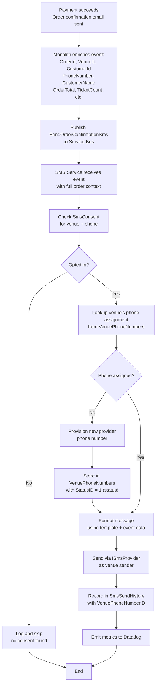
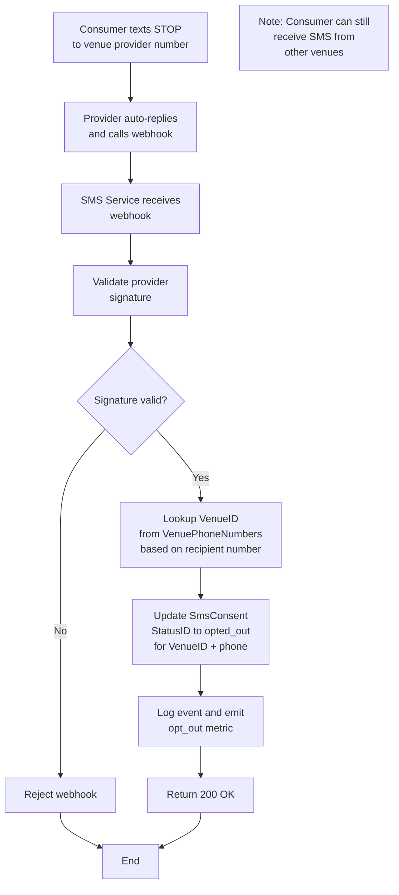

# TixTrack SMS Notification Service - Architecture Design

## Overview

A vendor-agnostic SMS notification service for sending order confirmation messages, designed to integrate with the existing TixTrack order flow while maintaining flexibility to swap SMS providers.

## Architecture Decisions

### Event-Driven Design
- **Trigger**: Event (`SendOrderConfirmationSms`) published to Azure Service Bus after order confirmation email is sent
- **Payload**: Fatter message includes order details (OrderId, VenueId, CustomerId, PhoneNumber, CustomerName, OrderTotal, TicketCount, EventTimestamp)
- **Rationale**: Eliminates database coupling to monolith; SMS service is self-contained and doesn't need to query shared tables. Event producer enriches message with order context at time of confirmation.

### Data Access Strategy
- **Owned tables (read/write)**: `SmsConsent`, `SmsSendHistory`, `VenuePhoneNumbers` - managed exclusively by the SMS service
- **No external database reads**: Event payload contains all order/customer data needed; no queries to monolith tables
- **Rationale**: Eliminates schema coupling to monolith; SMS service remains independent and can scale autonomously. Order data treated as immutable within event context.

### Provider Abstraction
- **Pattern**: Port/Adapter (Hexagonal Architecture)
- **Interface**: `ISmsProvider` with initial `TwilioSmsProvider` implementation
- **Rationale**: Enables swapping providers without modifying business logic

### Multi-Tenancy: Dedicated Phone Numbers per Venue
- **Strategy**: Each venue gets its own dedicated SMS provider phone number
- **Consumer Experience**: Ticket buyers always see the same sender number for each venue they interact with
- **Isolation**: Natural separation between venues - consumer buying tickets at multiple venues receives messages from different numbers
- **Compliance**: Each venue manages opt-outs independently (consumer can opt out of one venue but still receive from others)
- **Rationale**:
  - Better brand identity and trust (consistent sender per venue)
  - Simpler deliverability management (each venue has distinct sender reputation)
  - Phone number costs are negligible compared to B2B contract values
  - Cleaner compliance model (opt-outs are venue-specific, not customer-wide)

### Consent Management
- **SMS service owns all consent data** - not derived from user account flags
- **Consent scope**: Per-venue (consumer can opt out of one venue but remain opted in for others)
- **Initial consent**: Captured when user provides phone number during checkout (checkbox)
- **Opt-out handling**: Provider webhook updates local consent store for specific venue
- **Rationale**: Single source of truth for SMS channel; carrier-level opt-outs are captured via webhook; venue-scoped consent provides better consumer control

## Components

### SMS Notification Service (Azure Container Apps)

#### API Layer
| Endpoint | Method | Purpose |
|----------|--------|---------|
| `/webhook/twilio\|plivo` | POST | Receive STOP/START messages from SMS provider |
| `/api/consent/{venueId}/{phone}` | GET | Query consent status for venue (for other services) |
| `/api/history` | GET | Audit/compliance queries |

#### Service Layer
- **Service Bus Consumer**: Subscribes to `SendOrderConfirmationSms` topic
- **SMS Orchestrator**: Coordinates data retrieval, consent check, send, and history recording
- **Consent Service**: Manages opt-in/opt-out state
- **Template Engine**: Formats messages from templates + order data

#### Data Layer
- **Consent Repository**: CRUD for `SmsConsent` table
- **History Repository**: Write to `SmsSendHistory` table
- **Phone Number Repository**: CRUD for `VenuePhoneNumbers` table

### Database Tables (SMS-Owned)

#### Enum/Lookup Tables

```pseudocode
// Provider names enumeration
TABLE ProviderNames
  ID: int [primary key]
  Name: varchar(50) [unique, 'twilio', 'plivo']
  IsActive: bit [default 1]
  CreatedAt: datetime2

// Venue phone number status enumeration
TABLE VenuePhoneNumberStatuses
  ID: int [primary key]
  Name: varchar(50) [unique, 'active', 'inactive', 'released']
  IsActive: bit [default 1]
  CreatedAt: datetime2

// SMS consent status enumeration
TABLE SmsConsentStatuses
  ID: int [primary key]
  Name: varchar(50) [unique, 'opted_in', 'opted_out']
  IsActive: bit [default 1]
  CreatedAt: datetime2

// Initial consent source enumeration
TABLE ConsentSources
  ID: int [primary key]
  Name: varchar(50) [unique, 'checkout', 'account_settings', 'support_request']
  IsActive: bit [default 1]
  CreatedAt: datetime2

// SMS send history status enumeration
TABLE SmsSendHistoryStatuses
  ID: int [primary key]
  Name: varchar(30) [unique, 'sent', 'failed', 'skipped_no_consent', 'blocked_opted_out']
  IsActive: bit [default 1]
  CreatedAt: datetime2
```

#### Business Tables

```pseudocode
// Phone number assignments per venue
TABLE VenuePhoneNumbers
  ID: int [primary key]
  VenueID: int [required, FK to Venue.ID, part of unique constraint with ProviderNameID]
  PhoneNumber: varchar(20) [E.164 format, required, indexed]
  ProviderID: varchar(100) [provider-specific identifier, e.g., Twilio Phone Number SID, required]
  ProviderNameID: int [FK to ProviderNames.ID, required]
  StatusID: int [FK to VenuePhoneNumberStatuses.ID, required]
  AssignedAt: datetime2 [required]
  ReleasedAt: datetime2 [nullable]
  CreatedAt: datetime2 [required]
  UpdatedAt: datetime2 [required]
  UNIQUE INDEX: (VenueID, ProviderNameID) WHERE StatusID = 1 [active]

// Consent tracking (scoped to venue + consumer phone)
TABLE SmsConsent
  ID: int [primary key]
  VenueID: int [required, FK to Venue.ID, part of unique constraint]
  PhoneNumber: varchar(20) [required, part of unique constraint, indexed, E.164 format]
  StatusID: int [FK to SmsConsentStatuses.ID, required]
  ConsentSourceID: int [FK to ConsentSources.ID, nullable]
  InitialConsentAt: datetime2 [nullable]
  OptedOutAt: datetime2 [nullable]
  OptedInAt: datetime2 [nullable]
  CreatedAt: datetime2 [required]
  UpdatedAt: datetime2 [required]
  UNIQUE INDEX: (VenueID, PhoneNumber)

// Send history for audit/compliance
TABLE SmsSendHistory
  ID: bigint [primary key] [supports millions of SMS records]
  OrderID: uniqueidentifier [required, indexed]
  VenueID: int [required, FK to Venue.ID, indexed]
  VenuePhoneNumberID: int [required, FK to VenuePhoneNumbers.ID] [reference to venue's assigned phone]
  CustomerID: uniqueidentifier [required]
  CustomerPhoneNumber: varchar(20) [consumer phone number, required, indexed, E.164 format]
  Message: varchar(500) [SMS content sent, required]
  ProviderNameID: int [FK to ProviderNames.ID, required]
  StatusID: int [FK to SmsSendHistoryStatuses.ID, required]
  ProviderMessageID: varchar(100) [provider-specific message tracking ID, nullable]
  ErrorCode: varchar(50) [provider error code if failed, nullable]
  CreatedAt: datetime2 [required, indexed for time-range queries]
  INDEX: (VenueID, CreatedAt) [for compliance queries]
  INDEX: (CustomerPhoneNumber, VenueID) [for customer SMS history]
```

## Flows

### Order Confirmation SMS Flow



### Opt-Out Webhook Flow



### Error Handling
| Scenario | Action |
|----------|--------|
| Order cancelled | Skip, ack message |
| No consent | Skip, record in history |
| Provider 5xx error | Retry (nack message) |
| Provider opted-out error | Update consent, ack |
| Invalid phone error | Record failure, ack |

## Observability

### Datadog Metrics
- `sms.sent.total` - Counter by message_type, provider
- `sms.failed.total` - Counter by error_code, provider
- `sms.opt_out.total` - Counter
- `sms.opt_in.total` - Counter
- `sms.send.duration` - Histogram

### Application Insights
- Distributed tracing (correlation ID from Service Bus message)
- Structured logging for all operations
- Dependency tracking (database, SMS provider API)

### Alerts
- Send failure rate > 5%
- Webhook signature validation failures
- Provider API latency > 2s
- Dead letter queue depth > 0

## Future Extensibility

### Additional Message Types
Add new event types (e.g., `SendEventReminderSms`) and handlers without modifying core infrastructure.

### Additional Providers
Implement `ISmsProvider` for Plivo, MessageBird, etc. Provider selection can be configuration-driven.

### Multi-Region
Consent and history tables can be partitioned by region for UK/Australia expansion. Provider routing can be region-aware.
